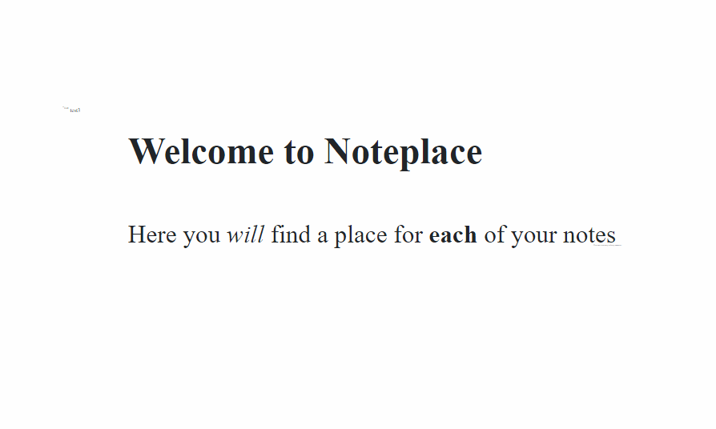

# Noteplace

at [https://eugenpt.github.io/noteplace/](https://eugenpt.github.io/noteplace/)

A place, for your notes.

A digital storage with characteristics of a physical space, where you can navigate using all your intuition from a physical world, but practically infinite and with search and filter (currently still on my TODO list!). 

## Features: 
- ~Inifinite Zoom
- Markdown (including URL-based images) + scale/rotate notes
- Private (no server-side, only downloads required libraries and images from URLs which you provide)
- Save to/Load from local file (so no internet connection really required once you download page)
- Google Drive save/load (uses AppFolder, does not see any of your files)
# Short demo:

---
## Licence

You may use Noteplace, and [contact me](mailto:eugen.pt@gmail.com) if you do because I'm eager to hear about it!

If you wish to use the code.. well, contact me, we'll figure it out (the code is ugly, among other things I'll ask if you're really sure).

Also - please don't misuse my API keys